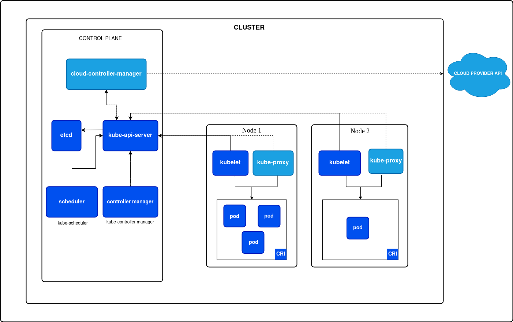

# 1. Vagrant

## 1.1 Overview

- **Vagrant**: Vagrant is a tool for building complete development environments. It can be considered as a wrapper around virtualization technologies like VirtualBox, VMware, and others, providing a simple command-line interface and configuration files to manage the lifecycle of development environments. It allows developers to create, configure, and provision virtual machines easily, ensuring that the development environment is consistent across different systems.

_Vagrant is a HashiCorp tool that simplifies creating and managing developer environments. It bridges the gap between the host machine (your local computer) and the guest machine (the virtual environment) to ensure seamless integration._ [Official documentation](https://developer.hashicorp.com/vagrant/tutorials/get-started/development-environment)


- **Development environments with Vagrant**: Development environments provide consistent setups for writing, testing, and debugging code. They help teams collaborate more effectively by ensuring reliability and portability, while addressing challenges like configuration drift and dependency issues.

- **`Vagrantfile`**: The `Vagrantfile` is a configuration file used by Vagrant to define the properties of the virtual environment. It specifies the base box to use, network settings, synced folders, and provisioning scripts. This file is written in Ruby and allows for a high degree of customization.

_Example of a `Vagrantfile`_:

```ruby
Vagrant.configure("2") do |config|
  config.vm.box = "ubuntu/focal64"
  config.vm.network "private_network", ip: "192.168.33.10"
  config.vm.synced_folder ".", "/vagrant", type: "rsync"
  config.vm.provider "virtualbox" do |vb|
    vb.memory = "1024"
  end

  config.vm.provision "shell", inline: <<-SHELL
    apt-get update
    apt-get install -y git
  SHELL
end
```

- **The Vagrant workflow**: The standard Vagrant workflow includes:
	1. **Scope** - Identify the requirements for your development environment, such as the OS, tools, and dependencies.
	2. **Author** - Write the ` Vagrantfile` to specify your environment.
	3. **Manage** - Use Vagrant commands to start, stop, and destroy environments.
	4. **Share** - Distribute the Vagrantfile or a packaged box with your team for consistent setups.

- **Vagrant Box**: A Vagrant box is a pre-configured virtual machine image that serves as a base for creating new Vagrant environments. Boxes can be shared and reused, allowing teams to standardize their development environments easily. Vagrant provides a public repository of boxes, and users can also create and publish their own.

- **Provisioning**: Provisioning is the process of configuring and setting up the software and services within a Vagrant environment. Vagrant supports various provisioning methods, including shell scripts, Ansible, Chef, and Puppet. This allows developers to automate the setup of their development environments and ensure consistency across different machines.

- **Provider**: A provider is a plugin that Vagrant uses to manage different virtualization technologies. Providers are responsible for creating, configuring, and managing the virtual machines. Some popular providers include **VirtualBox**, **VMware**, **HyperV**, **libvirt**, etc...

## 1.2 Vagrant with `libvirt`

- **`libvirt`**: Libvirt is an open-source API, daemon, and management tool for managing platform virtualization technologies. It provides a consistent interface for interacting with different hypervisors like KVM, QEMU, and others. Libvirt simplifies the management of virtual machines, networks, and storage by providing a unified set of commands and tools.

### _What is `libvirt`, `KVM`, and `QEMU` ?_

- **`KVM`**: KVM (Kernel-based Virtual Machine) is a virtualization technology built into the Linux kernel that allows the kernel to function as a hypervisor. It enables the creation and management of virtual machines on Linux systems, providing hardware virtualization capabilities.

- **`QEMU`**: QEMU (Quick Emulator) is an open-source machine emulator and virtualizer. It allows users to run virtual machines with different architectures and operating systems on a host machine. QEMU can be used in conjunction with KVM to provide full virtualization capabilities.

- **The relation between `libvirt`, `KVM`, and `QEMU`**: Libvirt acts as a management layer for KVM and QEMU, providing a unified API and set of tools for managing virtual machines. KVM provides the underlying virtualization capabilities, while QEMU handles the emulation of hardware and devices. Together, they enable the creation and management of virtualized environments.

**`QEMU`** = machine (hardware) emulator.
**`KVM`** = kernel module for Linux to enable virtualization; this is the hypervisor. QEMU can run without KVM but it can be quite a bit slower.
**`libvirt`** = virtualization library which wraps QEMU and KVM to provide APIs for use by other programs, such as Vagrant, which is a tool for creating virtualized development environments

Vagrant uses `libvirt`, and `libvirt` uses `QEMU` and `KVM`.

- **`virsh`**: `virsh` is a command-line interface for managing virtual machines through the libvirt API. It allows users to perform various tasks such as starting, stopping, and managing virtual machines, as well as configuring networks and storage.

I personally chose `libvirt` as provider because it's native to most Linux Distribution instead of Virtual Box for exemple. But it requires more configuration compared to other providers. We need to install the plugin `vagrant-libvirt`, here the [official documentation of `vagrant-libvirt`](https://vagrant-libvirt.github.io/vagrant-libvirt/).

## 1.3 Some useful commands

### 1.3.1 `vagrant` commands
- `vagrant init generic/fedora28 --box-version 4.3.12`: Initializes a new Vagrant environment with the specified box and version.
  - `vagrant`: command-line tool for managing Vagrant environments.
  - `init`: command to create a new Vagrantfile.
  - `generic/fedora28`: the name of the base box to use.
  - `--box-version 4.3.12`: specifies the version of the box to use.
- `vagrant up`: Starts the Vagrant environment and provisions the virtual machine.
- `vagrant halt`: Stops the running Vagrant environment.
- `vagrant destroy`: Destroys the Vagrant environment, removing all traces of the virtual machine.
- `vagrant box`: Manages Vagrant boxes (add, remove, list).
- `vagrant ssh`: Connects to the running Vagrant environment via SSH.
> You can add the flag `-c`/`--command` following by a command `"[SHELL_CMD]"` to run a specific command on the remote machine.

### 1.3.2 `virsh` commands
- `virsh`: A command-line interface for managing virtual machines in a hypervisor environment, such as KVM (Kernel-based Virtual Machine). It allows users to create, start, stop, and manage virtual machines and their resources. We use `libvirt` as provider for this project, so all the emulated VMs (with QEMU, etc...) will be managed through `virsh`.
- `virsh list`: Lists all active virtual machines.
- `virsh list --all`: Lists all virtual machines, including those that are not running.
- `virsh net-list`: Lists all virtual networks.
- `virsh start <vm-name>`: Starts a stopped virtual machine.
- `virsh shutdown <vm-name>`: Gracefully shuts down a running virtual machine.
- `virsh destroy <vm-name>`: Forces a virtual machine to stop.
- `virsh undefine <vm-name>`: Removes the definition of a virtual machine, but does not delete its disk images.
- `virsh console <vm-name>`: Connects to the console of a running virtual machine.

We use the `qemu:///system` URI to connect to the QEMU hypervisor, here some command to list VMs in this environment (and NOT with the `qemu:///session` URI):
- `virsh --connect qemu:///system list --all`: Lists all virtual machines managed by the QEMU hypervisor.
- `virsh --connect qemu:///system net-list --all`: Lists all virtual networks managed by the QEMU hypervisor.

For remove the entire definition of a virtual machine, you can use the following command:
```sh
virsh --connect qemu:///system undefine --domain <vm-name> --remove-all-storage
# Or
virsh undefine --domain <vm-name> --remove-all-storage
```

# 2. Kubernetes, K3s and others

- **`K8s - Kubernetes`**: Kubernetes is an open-source container orchestration platform designed to automate the deployment, scaling, and management of containerized applications. It provides a robust framework for managing clusters of hosts running Linux containers, allowing users to easily deploy and manage applications in a highly available and scalable manner. [The `Overview` of the official documentation](https://kubernetes.io/docs/concepts/overview/) describes extremely well the capabilities of Kubernetes.
> "_Containers are a good way to bundle and run your applications. In a production environment, you need to manage the containers that run the applications and ensure that there is no downtime. For example, if a container goes down, another container needs to start. Wouldn't it be easier if this behavior was handled by a system?<br><br> That's how Kubernetes comes to the rescue! Kubernetes provides you with a framework to run distributed systems resiliently. It takes care of scaling and failover for your application, provides deployment patterns, and more. For example: Kubernetes can easily manage a canary deployment for your system._". Go read the official documentation, it's a `S tier` documentation.

- **Objects in Kubernetes**: Kubernetes objects are persistent entities in the Kubernetes system. Kubernetes uses these entities to represent the state of your cluster. Learn about the Kubernetes object model and how to work with these objects. Again the [Official Documentation of Kubernetes - Working with objects](https://kubernetes.io/docs/concepts/overview/working-with-objects/) is very helpful. You provide the information to `kubectl` in a file known as **manifest**. It can be write int YAML or JSON format, exemple of a manifest for an **Object** called `Deployment`:

```yaml
apiVersion: apps/v1
kind: Deployment
metadata:
  name: nginx-deployment
spec:
  selector:
    matchLabels:
      app: nginx
  replicas: 2 # tells deployment to run 2 pods matching the template
  template:
    metadata:
      labels:
        app: nginx
    spec:
      containers:
      - name: nginx
        image: nginx:1.14.2
        ports:
        - containerPort: 80
```
<u>**An object in Kubernetes is a persistent entity that represents the desired state and configuration of resources within a cluster, such as deployments, services, or pods.**</u>

- **Workloads Resources**: A workload is an application running on Kubernetes. Whether your workload is a single component or several that work together, on Kubernetes you run it inside a set of pods. In Kubernetes, a Pod represents a set of running containers on your cluster.<br /><br />Kubernetes pods have a defined lifecycle. For example, once a pod is running in your **cluster** (we defined that later) then a critical fault on the **node** (same we defined that later) where that pod is running means that all the pods on that node fail. Kubernetes treats that level of failure as final: you would need to create a new Pod to recover, even if the node later becomes healthy.<br /><br />However, to make life considerably easier, you don't need to manage each Pod directly. Instead, you can use workload resources that manage a set of pods on your behalf. These resources configure controllers that make sure the right number of the right kind of pod are running, to match the state you specified.<br /><u>**In summary, workload resources in Kubernetes automate the management of pods, ensuring the desired state of your applications is maintained without manual intervention.**</u> [Official Documentation of Kubernetes - Workloads Resources](https://kubernetes.io/docs/concepts/workloads/)

- **Cluster Architecture**: A Kubernetes cluster consists of a control plane plus a set of worker machines, called **nodes**, that run containerized applications. Every cluster needs at least one **worker node** in order to run **Pods**. The **worker node(s)** host the **Pods** that are the components of the application workload. <u>**The control plane**</u> manages the **worker nodes** and the **Pods** in the cluster. In production environments, the control plane usually runs across multiple computers and a cluster usually runs multiple **nodes**, providing fault-tolerance and high availability.<br /><u>**A cluster is a set of machines (nodes) running containerized applications, managed by a control plane that orchestrates workloads and resources for high availability and scalability.**</u> [Official Documentation of Kubernetes - Cluster Architecture](https://kubernetes.io/docs/concepts/architecture/)



- **Node / Worker Node**: A worker node is a **physical or virtual machine** in a Kubernetes cluster that runs containerized applications. Each worker node hosts one or more **Pods**, and is managed by the **control plane**. Worker nodes communicate with the **control plane** to receive instructions and report on their status. Typically you have several nodes in a cluster; in a learning or resource-limited environment, you might have only one node. The **components** on a node include the kubelet, a container runtime, and the kube-proxy (we see later what is all these components)

- **Node Components**: [Official Documentation of Kubernetes - Node Components](https://kubernetes.io/docs/concepts/architecture/#node-components)

- **Namespace**: 

- **Pod**: A Pod is the smallest deployable unit in Kubernetes, representing a single instance of a running process in your cluster. Pods can contain one or more containers, and they share the same network namespace, allowing them to communicate with each other easily. Pods are designed to run a single application or service, and they can be scaled up or down based on demand. They also provide a way to manage the lifecycle of containers, including starting, stopping, and restarting them as needed.<br/> <u>**_A Pod is similar to a set of containers with shared namespaces and shared filesystem volumes._**</u><br /><br /> Pods in a Kubernetes cluster are used in two main ways:
  - **Single-container Pods**: The **"one-container-per-Pod"** model is the most common Kubernetes use case. In this case, you can think of a Pod as a wrapper around a single container; Kubernetes manages Pods rather than managing the containers directly.
  - **Multi-container Pods**: A Pod can encapsulate an application composed of multiple co-located containers that are tightly coupled and need to share resources. These co-located containers form a single cohesive unit.
> Grouping multiple co-located and co-managed containers in a single Pod is a relatively advanced use case. You should use this pattern only in specific instances in which your containers are tightly coupled.

Exemple of a single-container Pod manifest which consists of a container running the image `nginx:1.14.2`: [Official Documentation of Kubernetes - Pod](https://kubernetes.io/docs/concepts/workloads/pods/)

```yaml
apiVersion: v1
kind: Pod
metadata:
  name: nginx
spec:
  containers:
  - name: nginx
    image: nginx:1.14.2
    ports:
    - containerPort: 80
```

- **`kubectl`**: Kubectl is the command-line tool for interacting with Kubernetes clusters. It allows users to deploy applications, manage cluster resources, and inspect logs. Kubectl provides a powerful and flexible interface for working with Kubernetes, enabling developers to automate tasks and streamline their workflows.

- **`K3s`**: K3s is a lightweight Kubernetes distribution designed for resource-constrained environments and edge computing. It simplifies the deployment and management of Kubernetes clusters by reducing the complexity and resource requirements. K3s is packaged as a single binary and includes only the essential components needed to run Kubernetes, making it easy to install and operate.
