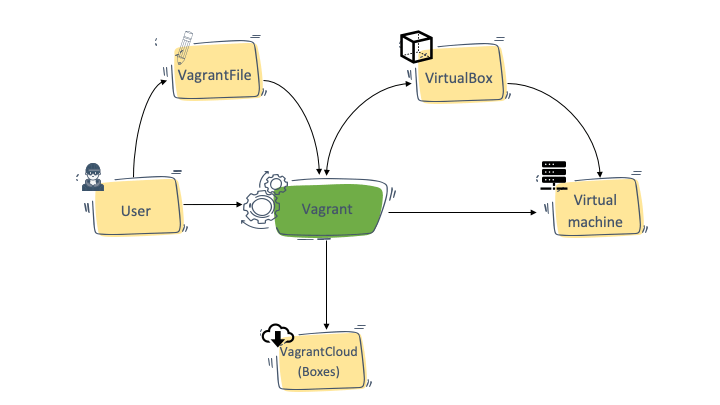

# 1. Vagrant

## 1.1 Overview

- **Vagrant**: Vagrant is a tool for building complete development environments. It can be considered as a wrapper around virtualization technologies like VirtualBox, VMware, and others, providing a simple command-line interface and configuration files to manage the lifecycle of development environments. It allows developers to create, configure, and provision virtual machines easily, ensuring that the development environment is consistent across different systems.

_Vagrant is a HashiCorp tool that simplifies creating and managing developer environments. It bridges the gap between the host machine (your local computer) and the guest machine (the virtual environment) to ensure seamless integration._ [Official documentation](https://developer.hashicorp.com/vagrant/tutorials/get-started/development-environment)



- **Development environments with Vagrant**: Development environments provide consistent setups for writing, testing, and debugging code. They help teams collaborate more effectively by ensuring reliability and portability, while addressing challenges like configuration drift and dependency issues.

- **`Vagrantfile`**: The `Vagrantfile` is a configuration file used by Vagrant to define the properties of the virtual environment. It specifies the base box to use, network settings, synced folders, and provisioning scripts. This file is written in Ruby and allows for a high degree of customization.

_Example of a `Vagrantfile`_:

```ruby
Vagrant.configure("2") do |config|
  config.vm.box = "ubuntu/focal64"
  config.vm.network "private_network", ip: "192.168.33.10"
  config.vm.synced_folder ".", "/vagrant", type: "rsync"
  config.vm.provider "virtualbox" do |vb|
    vb.memory = "1024"
  end

  config.vm.provision "shell", inline: <<-SHELL
    apt-get update
    apt-get install -y git
  SHELL
end
```

- **The Vagrant workflow**: The standard Vagrant workflow includes:
	1. **Scope** - Identify the requirements for your development environment, such as the OS, tools, and dependencies.
	2. **Author** - Write the ` Vagrantfile` to specify your environment.
	3. **Manage** - Use Vagrant commands to start, stop, and destroy environments.
	4. **Share** - Distribute the Vagrantfile or a packaged box with your team for consistent setups.

- **Vagrant Box**: A Vagrant box is a pre-configured virtual machine image that serves as a base for creating new Vagrant environments. Boxes can be shared and reused, allowing teams to standardize their development environments easily. Vagrant provides a public repository of boxes, and users can also create and publish their own.

- **Provisioning**: Provisioning is the process of configuring and setting up the software and services within a Vagrant environment. Vagrant supports various provisioning methods, including shell scripts, Ansible, Chef, and Puppet. This allows developers to automate the setup of their development environments and ensure consistency across different machines.

## 1.2 Vagrant with `libvirt`

<!-- TODO: explain all the micmac about the installation of the plugin `vagrant-libvirt`, and explain WHAT IS `libvirt`, `KVM`, `QEMU` and all other things how can creates some confusion -->

## 1.3 Some useful commands

### 1.3.1 `vagrant` commands
- `vagrant init generic/fedora38 --box-version 4.3.12`: Initializes a new Vagrant environment with the specified box and version.
  - `vagrant`: command-line tool for managing Vagrant environments.
  - `init`: command to create a new Vagrantfile.
  - `generic/fedora38`: the name of the base box to use.
  - `--box-version 4.3.12`: specifies the version of the box to use.
- `vagrant up`: Starts the Vagrant environment and provisions the virtual machine.
- `vagrant halt`: Stops the running Vagrant environment.
- `vagrant destroy`: Destroys the Vagrant environment, removing all traces of the virtual machine.
- `vagrant box`: Manages Vagrant boxes (add, remove, list).
- `vagrant ssh`: Connects to the running Vagrant environment via SSH.
> You can add the flag `-c`/`--command` following by a command `"[SHELL_CMD]"` to run a specific command on the remote machine.

### 1.3.2 `virsh` commands
- `virsh`: A command-line interface for managing virtual machines in a hypervisor environment, such as KVM (Kernel-based Virtual Machine). It allows users to create, start, stop, and manage virtual machines and their resources. We use `libvirt` as provider for this project, so all the emulated VMs (with QEMU, etc...) will be managed through `virsh`.
- `virsh list`: Lists all active virtual machines.
- `virsh list --all`: Lists all virtual machines, including those that are not running.
- `virsh net-list`: Lists all virtual networks.
- `virsh start <vm-name>`: Starts a stopped virtual machine.
- `virsh shutdown <vm-name>`: Gracefully shuts down a running virtual machine.
- `virsh destroy <vm-name>`: Forces a virtual machine to stop.
- `virsh console <vm-name>`: Connects to the console of a running virtual machine.

We use the `qemu:///system` URI to connect to the QEMU hypervisor, here some command to list VMs in this environment (and NOT with the `qemu:///session` URI):
- `virsh --connect qemu:///system list --all`: Lists all virtual machines managed by the QEMU hypervisor.
- `virsh --connect qemu:///system net-list --all`: Lists all virtual networks managed by the QEMU hypervisor.

# 2. Kubernetes, K3s and others

- **`K3s`**: K3s is a lightweight Kubernetes distribution designed for resource-constrained environments and edge computing. It simplifies the deployment and management of Kubernetes clusters by reducing the complexity and resource requirements. K3s is packaged as a single binary and includes only the essential components needed to run Kubernetes, making it easy to install and operate.

- **`kubectl`**: Kubectl is the command-line tool for interacting with Kubernetes clusters. It allows users to deploy applications, manage cluster resources, and inspect logs. Kubectl provides a powerful and flexible interface for working with Kubernetes, enabling developers to automate tasks and streamline their workflows.
